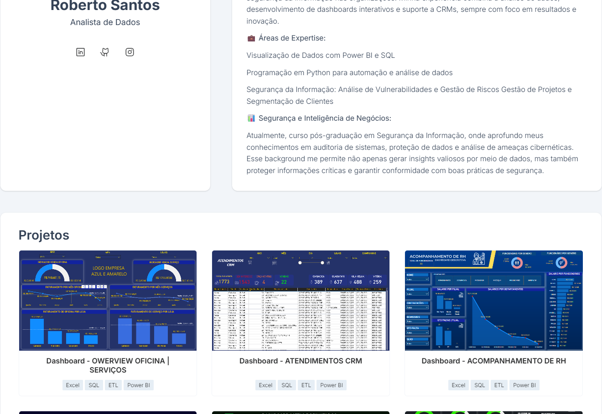

<h1 align="center"> Portfólio - Roberto Santos</h1>

<h3 align="center">Analista de Dados</h3>

  <a href="#-tecnologias">TECNOLOGIAS</a>&nbsp;&nbsp;&nbsp;|&nbsp;&nbsp;&nbsp;
  <a href="#-projeto">PROJETO</a>&nbsp;&nbsp;&nbsp;

 

### 🚀 TECNOLOGIAS

✅ Json para criação dos projetos de forma dinâmica.

✅ Animações com a biblioteca AOS

✅ Uso semântico do HTML

✅ Variáveis do CSS no :root

✅ Performance

✅ Responsivo

✅ Meta dados

 

### 💻 Sobre o Projeto

Este portfólio foi desenvolvido como uma vitrine profissional, destacando minhas habilidades, experiência e projetos desenvolvidos. Ele reflete meu compromisso com a excelência e o crescimento contínuo na área de Análise e Desenvolvimento de Sistemas. Além de aprimorar constantemente seu conteúdo, busco agregar melhorias visuais e técnicas que melhor representam meu trabalho. Meu objetivo é demonstrar minhas competências de forma clara e objetiva, conectando-me com oportunidades que permitam meu desenvolvimento profissional.

 

---

by betox.santos

